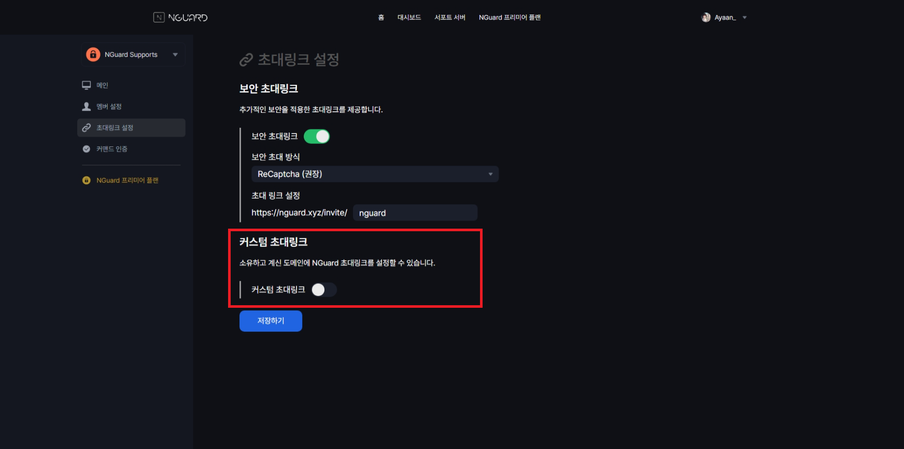

# 👩💻 Custom Domain Setup

By default, an invite link is created that looks like `https://nguard.xyz/invite/[something]`. \
However, if you are using the Enterprise plan, you can set up an invite link on a domain you own.

To set up a custom domain, please follow the steps below.

If you encounter any problems while following the steps in this section,\
please contact us through Channel.io at the bottom right of the NGuard Console.

## 1. Choosing a domain

You can only set up `subdomains`. `Apex domains` are not available.

Here are some examples of what you can and cannot choose from:

| Domain type      | Example                                                                                                         | Supported? |
| ---------------- | --------------------------------------------------------------------------------------------------------------- | :--------: |
| Apex domain      | `example.com`                                                                                                   |      ❌     |
| `www` subdomain  | `www.example.com`                                                                                               |      ✅     |
| Custom subdomain | 
<code>discord.example.com</code> <code>invite.example.com</code> <code>anything.example.com</code>
 |      ✅     |

## 2. Setting up a custom domain

If you go into the invitation link settings in the NGuard Console,\
you can see a menu where you can set a custom domain.

<figure><figcaption></figcaption></figure>

Once you activate the custom invitation link toggle, you will see a screen like the one below:

<figure><figcaption></figcaption></figure>

Now enter the custom domain you want to set up in the ‘Domain Settings’ field.\
(Do not save yet.)

## 3. Setting up DNS

DNS settings must be done through your DNS provider, not through the NGuard Console.

**This step is very important if you want to use an invitation link with your custom domain.**

### Setting up CNAME records

The names of the fields and what to actually enter to configure the record may differ between DNS control panels, but we've covered the most common options here. If you're in any doubt, check with your DNS provider.

* The **type** is the kind of DNS record that you want to create. Here, you need to choose **CNAME**.
* The **name** or **DNS entry** is where you enter your subdomain. You might need to enter it in full (e.g. **docs.example.com**) or you might just need to enter the part before your apex domain (e.g. **docs**). If you're not sure which to use, check with your DNS provider.
* The **target** or **value** or **destination** is where the subdomain should be pointed.
* It is recommended that **TTL (Time-to-Live)** be set to **auto** or **43200 secs** (12 hours) or **86400 secs** (24 hours).

Here's an example of how a correct configuration looks in Cloudflare's control panel:

<figure><figcaption></figcaption></figure>

#### Are you using Cloudflare?

If you are using Cloudflare as your DNS provider, make sure it is set to **Orange Cloud (Proxied)**. **Turn off SSL settings** in NGuard Console.

Afterwards, set the SSL settings to **Flexible** in Cloudflare's SSL tab. If there are other services already running, create Configuration Rules in the Rules tab and set them as follows.

<figure><figcaption></figcaption></figure>

If you wish, you can set it to **gray cloud (DNS-only)** and **turn on SSL**, but we do not recommend it. This is because security may become vulnerable. If it is not an orange cloud, other users may abuse the service or conduct DDoS attacks.

### Wait for the changes to take effect

Remember the TTL (Time To Live) field we mentioned earlier?\
DNS records are cached for a period of time — which is usually a very good thing for performance reasons, because they typically don't change very often.

However, when changes are made, it may take some time for them to be re-cached. In most cases this will take about an hour. Sometimes everything updates a little faster, sometimes it takes longer.

You can check whether the DNS settings are being applied on a site called [WhatsMyDNS](https://www.whatsmydns.net/#CNAME).\
Enter the entire custom domain you set at the top of this site and click Search.

<figure><figcaption></figcaption></figure>

If DNS is not yet applied, you will see something like below:

<figure><figcaption></figcaption></figure>

If DNS has been applied successfully, you will see something like below:

<figure><figcaption></figcaption></figure>

Once you have confirmed that DNS has been applied, you can proceed to the next step.\
**If SSL settings are turned on, do not proceed to the next step until DNS is successfully applied.**

## 4. Complete setup process

Go back to the NGuard Console from step 2.

<figure><figcaption></figcaption></figure>

Now click the save button to save it.

<figure><figcaption></figcaption></figure>

Please click the ‘Confirm’ button to save.

**🎉 Custom domain setup is complete! Try connecting to the custom domain you set up!**
