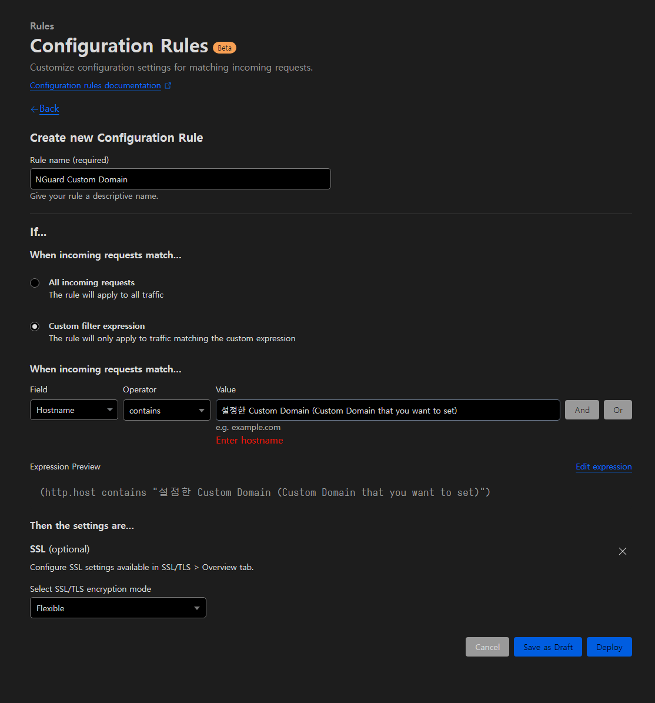

# 🛫 Getting ready

## 1. What is NGuard Console?

NGuard Security provides NGuard Console service so that users can easily check and change security settings and indicators.


NGuard Console can be used **by sign in to Discord without sign up process**.


## 2. Sign in to NGuard Console

If you access [https://console.nguard.xyz](https://console.nguard.xyz), you will be automatically redirected to the login page.

After that, sign in to Discord to complete the sign in.

<figure><figcaption></figcaption></figure>

## 3. Invite a bot

To use the NGuard Security service, you must invite the bot to the server you wish to provide security services to.

After logging in to the NGuard Console, click the "Invite" button to the server you want to invite on the server selection screen that appears.

<figure><figcaption></figcaption></figure>

## 4. Introducing Dashboard

If you invite the bot and select the server, you will be connected to the dashboard.

The main page shows simple server indicators and security alerts.

<figure><figcaption></figcaption></figure>

In the Member Settings menu on the right, you can check the server's users at a glance,\
and you can report them to NGuard as a blacklist.

<figure><figcaption></figcaption></figure>

To register/report as a blacklist, click Register Blacklist to the right of the member.

<figure><figcaption></figcaption></figure>

Conversely, if you want to delete it, just click Delete Blacklist.

However, you cannot delete it if our reviews and registers it on the global blacklist after a certain period of time after registration.

<figure><figcaption></figcaption></figure>

In the invite link setting menu on the right, you can set the "Secure invite link", which is the main function of NGuard.

<figure><figcaption></figcaption></figure>

Currently, Recaptcha and Recaptcha + multi-factor authentication are available for secure invitation link authentication, and may be added later.

If you use the free plan, you must vote a bot to the Koreanlist.

Once you make a vote, you can use these services without a referral for 12 hours.

<figure><figcaption></figcaption></figure>

In the command verify menu on the right, you can set the server to perform authentication using commands.

<figure><figcaption></figcaption></figure>

