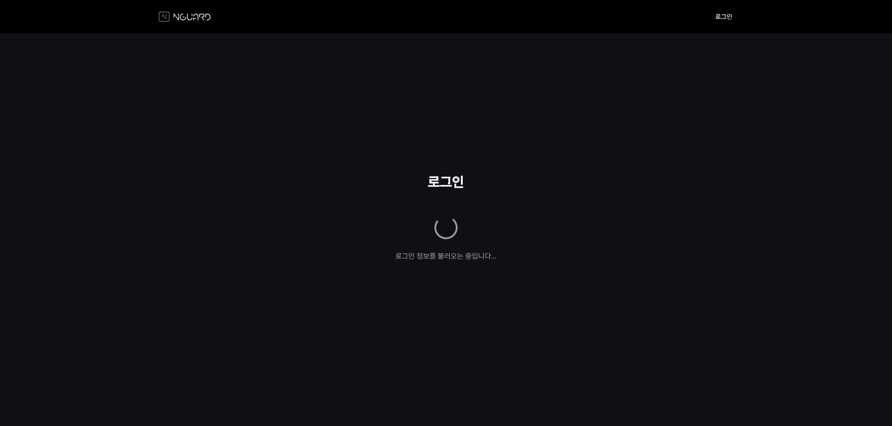
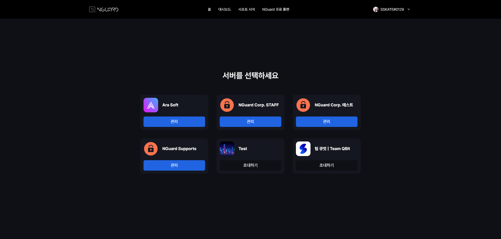
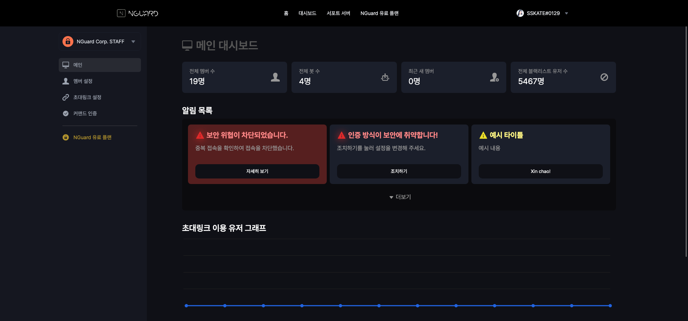
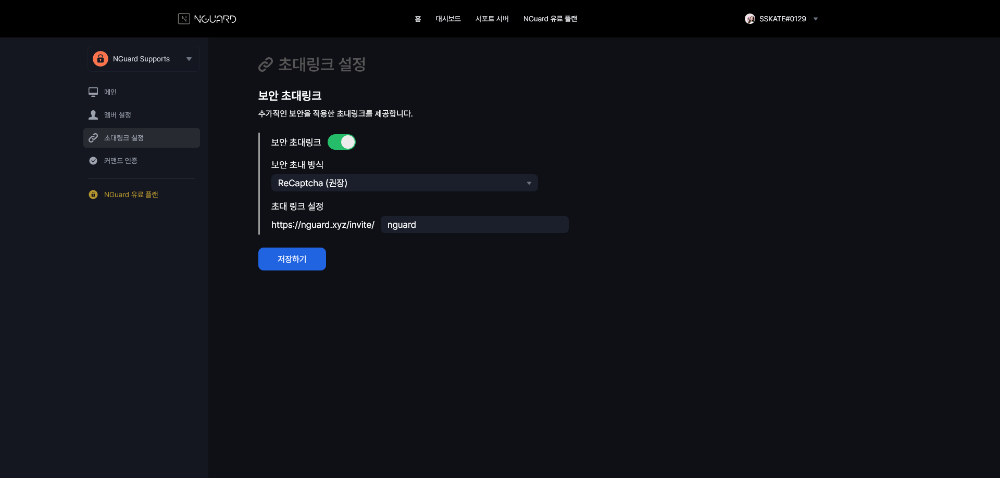

# 🛫 NGuard Security 入門


このセクションの一部の内容は機械翻訳された可能性があります。\
翻訳に問題がある場合は、「[ここ](https://nguard.channel.io)」をクリックしてNGuardチームに送信してください。


## 1. NGuard Consoleとは何ですか?

NGuard Security は、ユーザーがセキュリティ設定とインジケーターを簡単に確認および変更できるように、NGuard コンソール サービスを提供します。


NGuard Consoleは、サインアッププロセスを必要とせずにDiscordにサインインすることで使用できます。


## 2. NGuard Consoleにサインインする

[https://console.nguard.xyz](https://console.nguard.xyz) にアクセスすると、自動的にログイン ページにリダイレクトされます。

その後、Discordにサインインすればサインインは完了です。

<figure><figcaption></figcaption></figure>

## 3. ボットを招待する

NGuard Security サービスを使用するには、セキュリティ サービスを提供したいサーバーにボットを招待する必要があります。

NGuard Consoleにログイン後、表示されるサーバー選択画面で招待したいサーバーの「招待」ボタンをクリックします。

<figure><figcaption></figcaption></figure>

## 4. ダッシュボードの紹介

ボットを招待してサーバーを選択すると、ダッシュボードに接続されます。

<figure><figcaption></figcaption></figure>

メイン ページには、シンプルなサーバー インジケーターとセキュリティ アラートが表示されます。

<figure><figcaption></figcaption></figure>

右側の「メンバー設定」メニューでは、サーバーのユーザーを一目で確認できます。\
&#x20;これらをブラックリストとして NGuard に報告できます。

<figure><figcaption></figcaption></figure>

ブラックリストとして登録/報告するには、メンバーの右側にある「ブラックリストの登録」をクリックします。

<figure><figcaption></figcaption></figure>

逆に、削除したい場合は、「ブラックリストの削除」をクリックするだけです。

ただし、登録後一定期間が経過すると、当社の審査によりグローバルブラックリストに登録される場合は削除することができません。

<figure><figcaption></figcaption></figure>

右側の招待リンク設定メニューでは、NGuardのメイン機能である「安全な招待リンク」を設定できます。

<figure><figcaption></figcaption></figure>

現在、安全な招待リンク認証には Recaptcha と Recaptcha + 多要素認証が利用可能ですが、後で追加される可能性があります。

無料プランを使用する場合は、Koreanlist にボットを投票する必要があります。

一度投票すると、12 時間は紹介なしでこれらのサービスを利用できます。

<figure><figcaption></figcaption></figure>

右側のコマンドベリファイメニューでは、サーバがコマンドによる認証を行うように設定できます。

<figure><figcaption></figcaption></figure>
