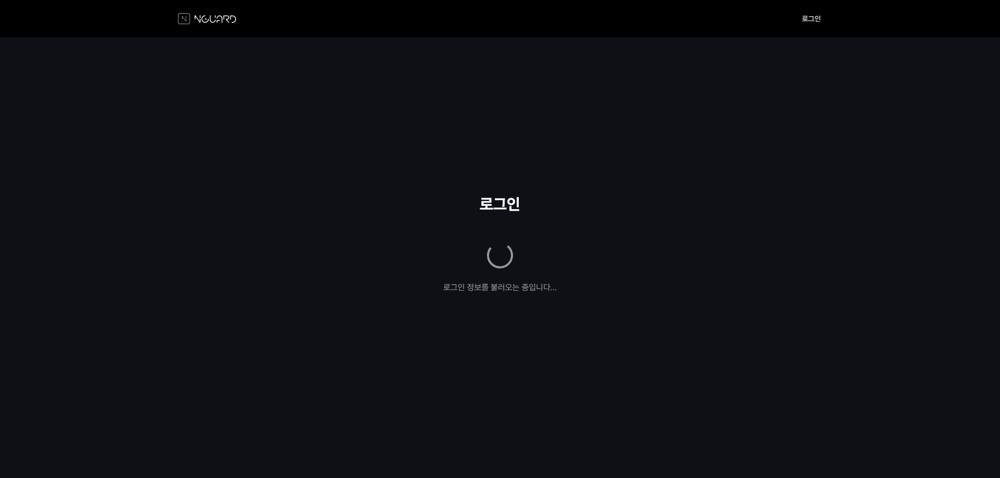
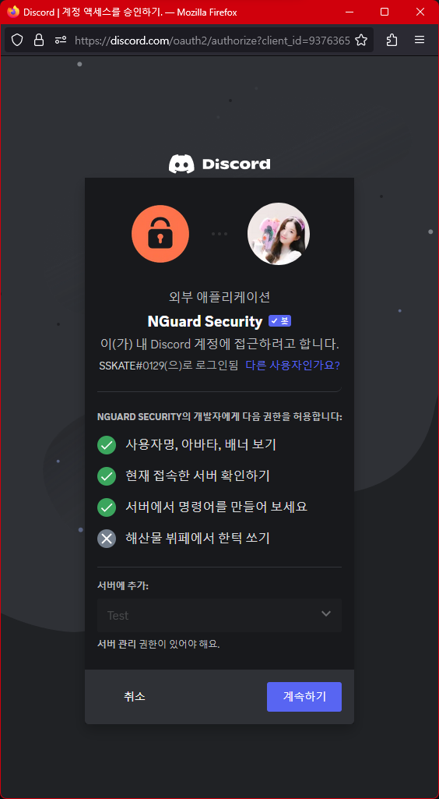
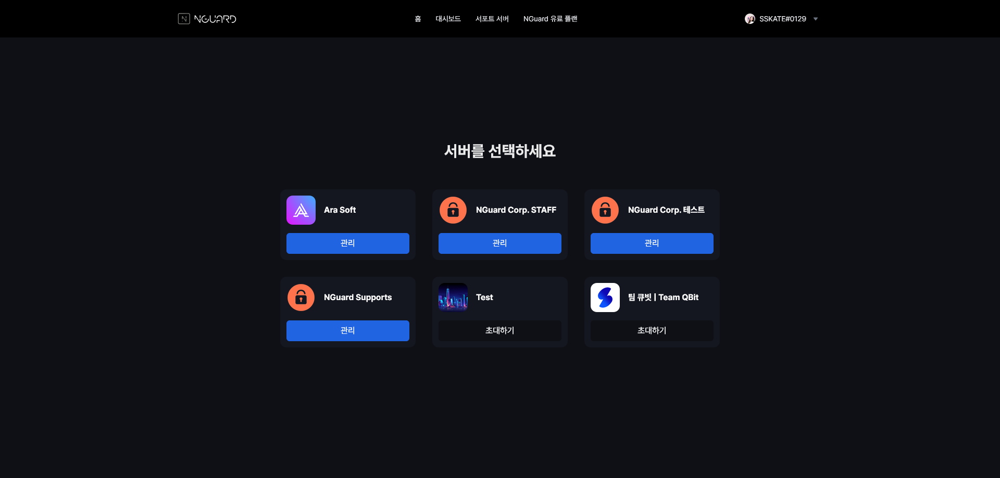
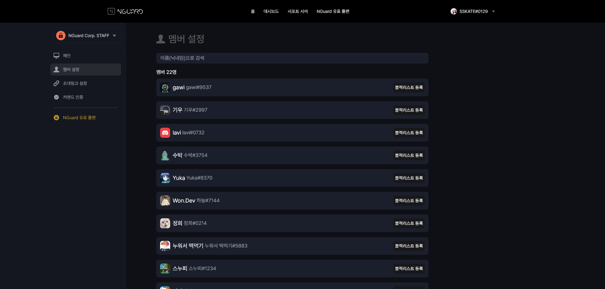
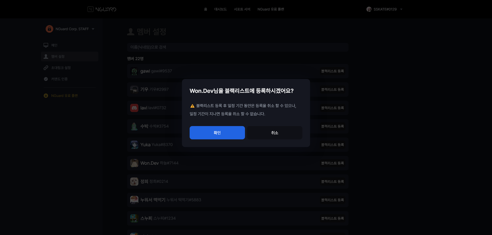
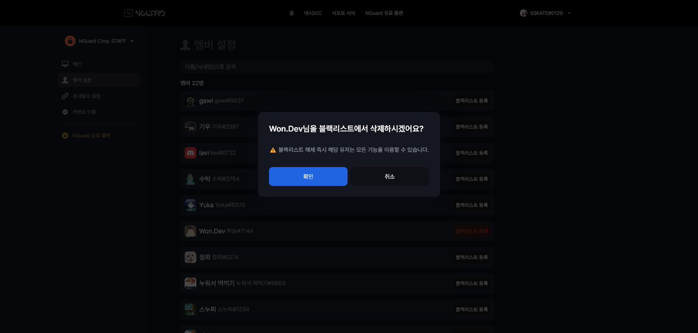
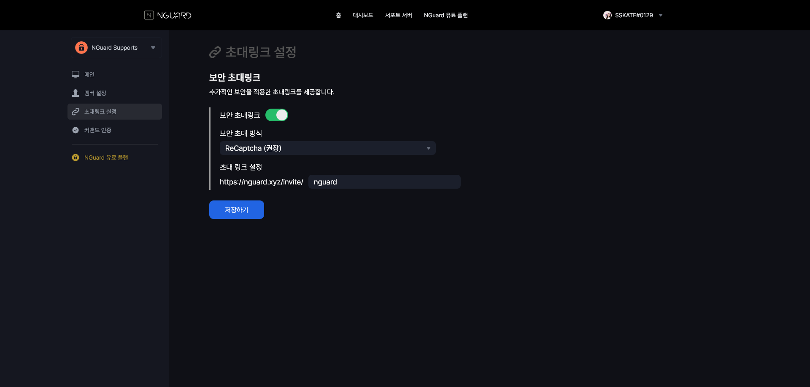
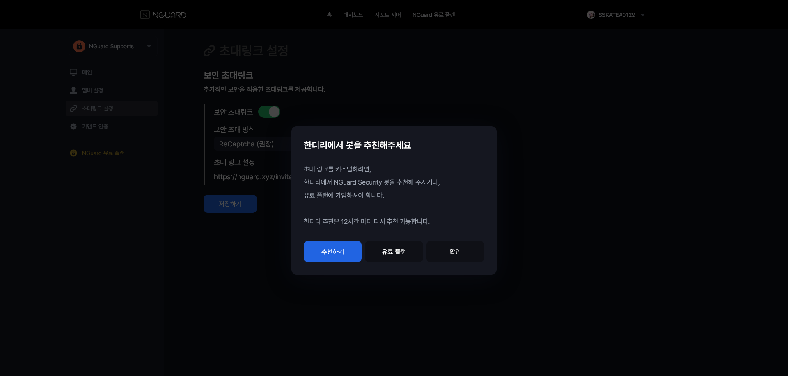
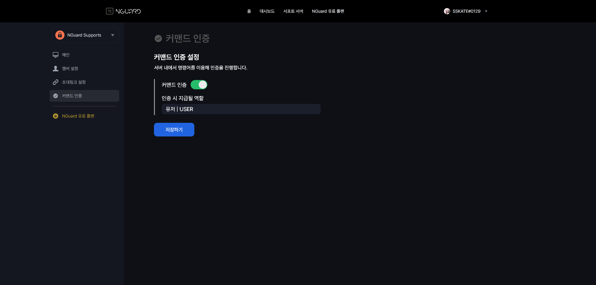

# 🛫 서비스 이용 준비하기

## 1. NGuard Console 이란?

NGuard Security는 사용자 여러분이 보안 설정과 지표를 손쉽게 확인 및 변경하실 수 있도록 NGuard Console 서비스를 제공합니다.


NGuard Console은 **별도 회원가입 없이 Discord 로그인** 만으로 이용이 가능합니다.


## 2. NGuard Console 로그인 하기

[https://console.nguard.xyz](https://console.nguard.xyz) 에 접속하시면, 자동으로 로그인 페이지로 이동됩니다.

이후 Discord 로그인을 진행해 주시면 로그인이 완료됩니다.

<figure><figcaption></figcaption></figure>

## 3. 봇 초대하기

NGuard Security 서비스를 이용하시려면, 보안 서비스를 제공하고 싶은 서버에 봇을 초대하셔야 합니다.

NGuard Console에 로그인하시고 나면 보이는 서버 선택 화면에서, 초대를 하고 싶은 서버에 "초대하기" 버튼을 눌러주세요.

<figure><figcaption></figcaption></figure>

## 4. 대시보드 둘러보기

봇을 초대하시고, 서버 선택화면에서 해당 서버를 선택하셨다면 대시보드에 접속이 됩니다.

메인 화면에는 서버의 간단한 지표와 보안 알림이 보이게 됩니다.

<figure><figcaption></figcaption></figure>

우측 멤버 설정 메뉴에서는 서버의 유저를 한 눈에 확인하실 수 있고, 블랙리스트로 NGuard에 신고 하실 수 있습니다.

<figure><figcaption></figcaption></figure>

블랙리스트로 등록/신고하려면 해당 멤버 우측에 있는 블랙리스트 등록을 누르면 됩니다.

<figure><figcaption></figcaption></figure>

반대로 삭제할 경우 블랙리스트 삭제를 누르면 됩니다.

단, 등록 후 일정 기간이 지나 NGuard에서 검토 후 글로벌 블랙리스트에 등록을 시킨 경우 삭제가 불가능합니다.

<figure><figcaption></figcaption></figure>

우측 초대링크 설정 메뉴에서는 NGuard의 메인 기능인 "보안 초대링크"를 설정할 수 있습니다.

<figure><figcaption></figcaption></figure>

현재 보안 초대링크의 인증 방식은 Recaptcha, Recaptcha + 다중 인증이 있으며, 추후 추가될 수 있습니다.

무료 플랜을 사용하실 경우, 한국 디스코드 리스트에 봇 추천을 하셔야 합니다.

한번 추천하시면 12시간 동안 추천 없이 서비스를 이용할 수 있습니다.

<figure><figcaption></figcaption></figure>

우측 커맨드 인증 메뉴에서는, 서버 내에서 명령어를 이용해 인증을 진행할 수 있도록 설정할 수 있습니다.

<figure><figcaption></figcaption></figure>

