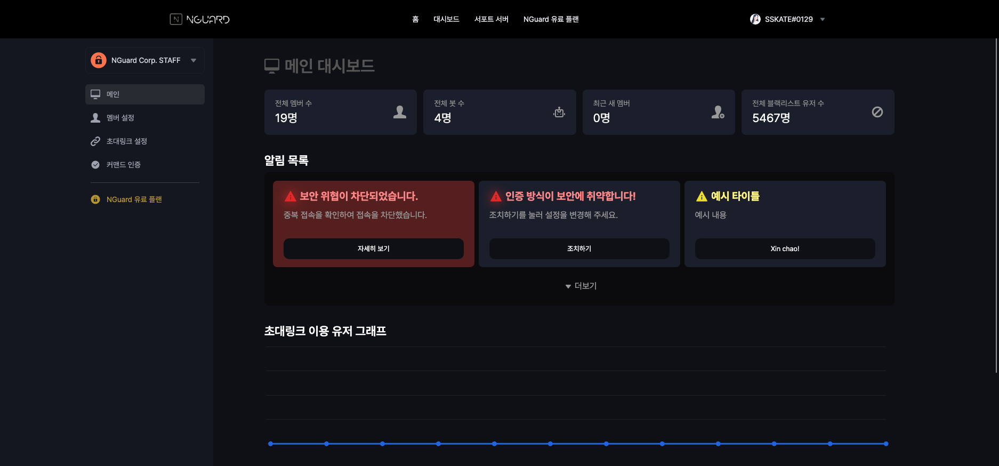

# 🛫 Chuẩn bị sẵn sàng

## 1. NGuard Console là gì?

NGuard Security cung cấp dịch vụ NGuard Console để người dùng có thể dễ dàng kiểm tra và thay đổi các cài đặt và chỉ báo bảo mật.


NGuard Console có thể được sử dụng bằng cách đăng nhập vào Discord mà không cần quá trình đăng ký.


## 2. Đăng nhập vào NGuard Console

Nếu truy cập [https://console.nguard.xyz](https://console.nguard.xyz), sẽ tự động được chuyển hướng đến trang đăng nhập.

Sau đó, đăng nhập vào Discord để hoàn tất đăng nhập.

<figure><figcaption></figcaption></figure>

## 3. Mời bot

Để sử dụng dịch vụ NGuard Security, bạn phải mời bot đến máy chủ mà bạn muốn cung cấp dịch vụ bảo mật.

Sau khi đăng nhập vào NGuard Console, hãy nhấp vào nút "Mời" vào máy chủ bạn muốn mời trên màn hình chọn máy chủ xuất hiện.

<figure><figcaption></figcaption></figure>

## 4. Giới thiệu Bảng điều khiển

Nếu bạn mời bot và chọn máy chủ, thì bạn sẽ được kết nối với trang tổng quan.

<figure><figcaption></figcaption></figure>

Trang chính hiển thị các chỉ báo máy chủ đơn giản và cảnh báo bảo mật.

<figure><figcaption></figcaption></figure>

Trong menu Cài đặt thành viên ở bên phải, bạn có thể kiểm tra nhanh người dùng của máy chủ,\
và bạn có thể báo cáo chúng cho NGuard dưới dạng danh sách đen.

<figure><figcaption></figcaption></figure>

Để đăng ký/báo cáo là một danh sách đen, hãy nhấp vào Đăng ký danh sách đen ở bên phải của thành viên.

<figure><figcaption></figcaption></figure>

Ngược lại, nếu bạn muốn xóa nó, chỉ cần nhấp vào Xóa danh sách đen.

Tuy nhiên, bạn không thể xóa nó nếu chúng tôi xem xét và đăng ký nó vào danh sách đen toàn cầu sau một khoảng thời gian nhất định sau khi đăng ký.

<figure><figcaption></figcaption></figure>

Trong menu cài đặt liên kết mời ở bên phải, bạn có thể đặt "Liên kết mời an toàn", đây là chức năng chính của NGuard Security.

<figure><figcaption></figcaption></figure>

Hiện tại, Recaptcha và Recaptcha + xác thực đa yếu tố khả dụng để xác thực liên kết lời mời an toàn và có thể được thêm vào sau.

Nếu bạn sử dụng gói miễn phí, bạn phải bỏ phiếu bot vào Koreanlist.

Sau khi bỏ phiếu, bạn có thể sử dụng các dịch vụ này mà không cần giấy giới thiệu trong 12 giờ.

<figure><figcaption></figcaption></figure>

Trong menu xác minh lệnh ở bên phải, có thể đặt máy chủ thực hiện xác thực bằng các lệnh.

<figure><figcaption></figcaption></figure>

